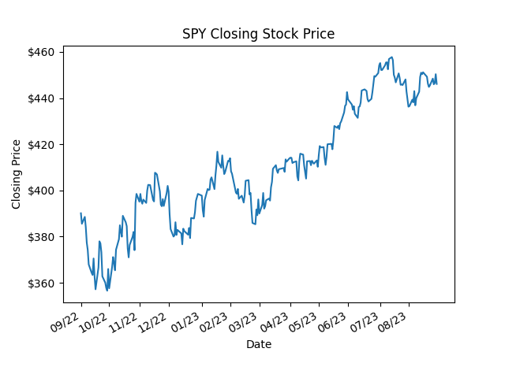

# Individual Project 1: IDS 706 Data Engineering Systems
---
Continuous Integration using GitHub Actions of Python Data Science Project

---
## Github Actions: Install, Format, Lint, and Test!
* 
* 
* 
* 
---

## Project Structure:

1. Jupyter Notebook with Descriptive Statistics using Pandas and testing by nbval plugin
2. Python Script performing the same Descriptive Statistics
3. lib.py that shares the common code
4. Makefile that runs all tests, formats with python black, lints with Ruff, and installs libraries
5. Two test scripts: test_script.py
6. Requirements.txt that lists the the packages for use
7. Github actions that perform the four makefile functions

---

## Grading Rubric:
1. Project Structure (15 points): Proper organization and inclusion of all required files.
    * [Jupyter Notebook](Descriptive_Statistics.ipynb): 4 points
    * [Python Script](main.py): 4 points
    * [lib.py](lib.py) file: 4 points
    * [Makefile](makefile): 3 points

2. Content of [Jupyter Notebook](Descriptive_Statistics.ipynb) and [Python Script](main.py) (20 points)
    * Correct and efficient use of Polars or Panda: 10 points
    * Accuracy of descriptive statistics: 10 points

3. Testing with nbval plugin for pytest (10 points): Correct usage and implementation of the nbval plugin for pytest in the Jupyter Notebook.
    * See [makefile](makefile) for implementation of nbval plugin for pytest in Jupyter Notebook.

4. Shared code in [lib.py](lib.py) (10 points): The lib.py file correctly shares the common code between the script and notebook.

5. [Makefile](makefile) Commands (15 points): The Makefile correctly includes and executes all required commands.
    * Running all tests (notebook, script, lib): 5 points
    * Formatting code with Python black: 5 points
    * Linting code with Ruff: 5 points

6. Test Scripts (10 points): The [test_script.py](test_script.py) and [test_lib.py](test_lib.py) files accurately and efficiently test the Python script and library.
    * test_script.py: 5 points
    * test_lib.py: 5 points

7. [Requirements.txt](requirements.txt) (5 points): The requirements.txt file is correctly pinned and installed via pip install -r requirements.txt.

8. GitHub Actions (10 points): GitHub Actions correctly performs all Makefile commands and displays badges for each one in the README.md.
   * [install.yml](.github/workflows/install.yml)
   * [format.yml](.github/workflows/format.yml)
   * [lint.yml](.github/workflows/lint.yml)
   * [test.yml](.github/workflows/test.yml)

9. Demo Video (15 points): A 2-5 minute video is included, explaining the project and demonstrating its functionality. The video should be of high quality (both audio and visual), not exceed the given time limit, and be linked in the README via a private or public YouTube link.
    * Clarity of explanation: 5 points
    * Quality demonstration of the project: 5 points
    * Quality of video and audio: 5 points
      
## Demo:

[Individual Project 1 Demo](https://www.youtube.com/watch?v=hSVbEFGh5jw)

## Summary Statistics:

## Line Chart

